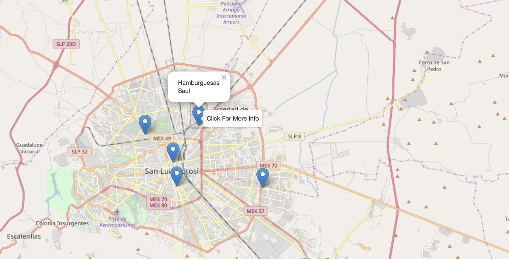

# RESTAURANT RECOMMENDATION USING CONTENT-BASED FILTERING

Using combination of __Random Forest Classifier & Cosine Similarity__ to predict the top 5 restaurant in Mexico which suitable with user preferences depende on 7 criterias:
1. __City__
2. __Alcohol__
3. __Smoking Area__
4. __Dress Code__
5. __Price__
6. __Ambience__
7. __Area__

I use datasets from __["Restaurant Data with Consumer Ratings"](https://www.kaggle.com/uciml/restaurant-data-with-consumer-ratings#userprofile.csv)__ provided by Kaggle.

You could clone this Github and try to run __*app_resto_recom.py*__

In brief there are 3 html pages which will show you this restaurant recommendation system:

1. Home Page

    At the home page you are supposed to give 7 input criterias what kind of restaurant that you're looking for:

    

    Then, the machine will give you top 5 restaurant recommendations that 80% up fits with you.

2. Result Page

    In this page will summarize what are your inputs and the results of top 5 restaurant recommendations

    

    Then you can find the restaurant locations on maps, or just go back to home page

3. Map Page

    In this page will give you the coordinate of Top 5 restaurant recommendations on maps. I use [Folium](https://python-visualization.github.io/folium/) packages to show this map

    

Hope you enjoy it.. Cheers!

#
#### About Me: Suryo Tri Atmojo 👨‍🔬👨‍💻
#### Reach me out 📬 : _atmojo.suryo@gmail.com_

[GitHub](https://github.com/suryotriatmojo)
|
[Instagram](https://www.instagram.com/suryotriatmojo/)
|
[Facebook](https://www.facebook.com/suryo.t.atmojo)
|
[LinkedIn](https://www.linkedin.com/in/suryo-tri-atmojo-3ab69a85/)
|
[Twitter](https://twitter.com/suryota)