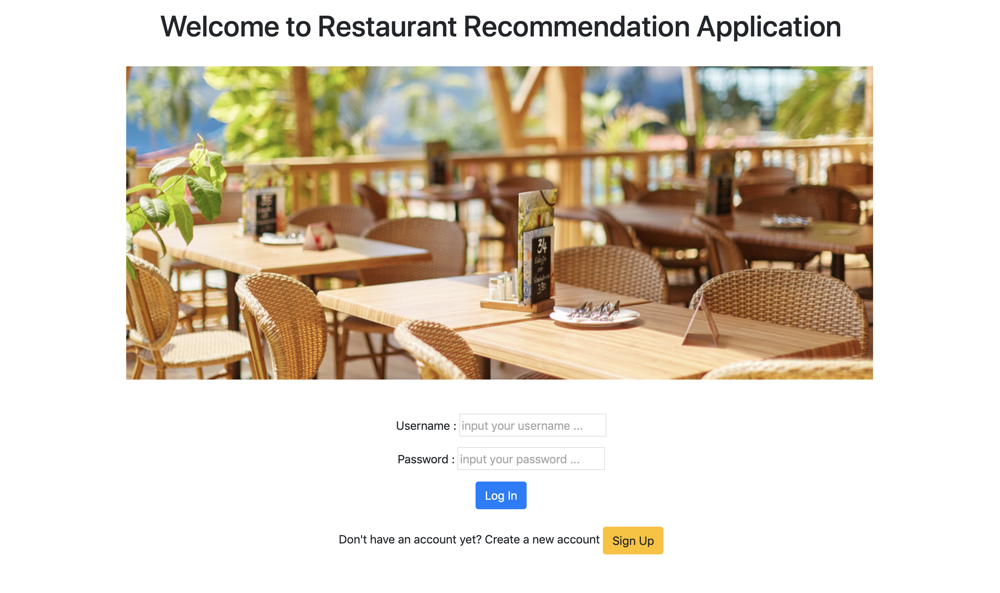
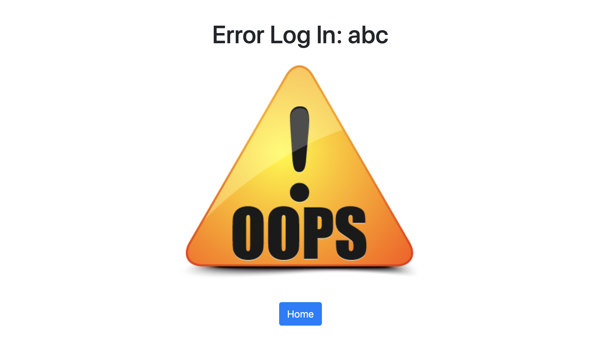
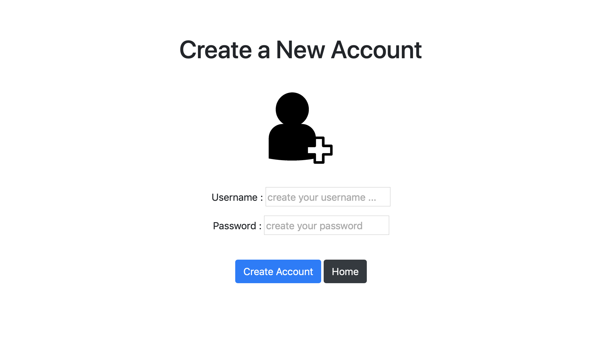
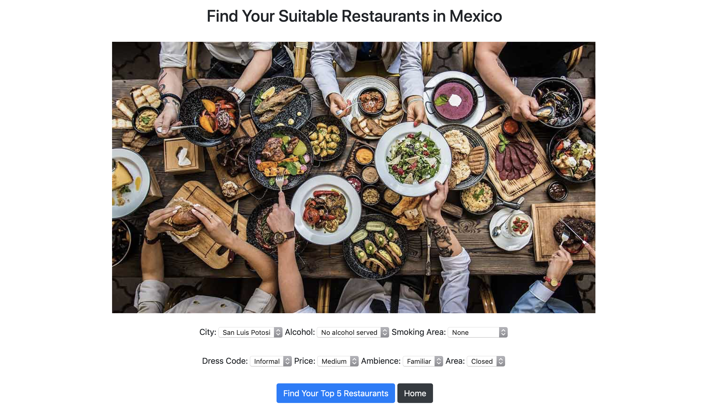

# RESTAURANT RECOMMENDATION USING CONTENT-BASED FILTERING

Using combination of __Random Forest Classifier & Cosine Similarity__ to predict the top 5 restaurant in Mexico which suitable with user preferences depende on 7 criterias:
1. __City__
2. __Alcohol__
3. __Smoking Area__
4. __Dress Code__
5. __Price__
6. __Ambience__
7. __Area__

I use datasets from __["Restaurant Data with Consumer Ratings"](https://www.kaggle.com/uciml/restaurant-data-with-consumer-ratings#userprofile.csv)__ provided by Kaggle.

You could clone this Github and try to run __*app_resto_recom.py*__

In brief there are 6 html pages which will show you this restaurant recommendation application:

1. Home Page

    This is the first landing page. In this page you can log in (if you have already registered before) or sign up (if want make a new account or not registered yet before)

    

2. Error Log In Page

    If you Log In with unregistered username or wrong password then it gives you Error Page

    

3. Sign Up Page
    From Home Page if you click Sign Up button, then you can create a new account, please input your username and password and it will be stored to json file -> database.json

    

4. Main Page

    At the Main page you are supposed to give 7 input criterias what kind of restaurant that you're looking for:

    

    Click "Find your top 5 restaurant" button, then the machine will give you top 5 restaurant recommendations that 80% up fits with you.

    Or you can go back to Home Page

5. Result Page

    In this page will summarize what are your inputs and the results of top 5 restaurant recommendations

    

    Then you can find the restaurant locations on maps by click "Show Location" button, or just go back to Main page and Home page

6. Map Page

    In this page will give you the coordinate of Top 5 restaurant recommendations on maps. I use [Folium](https://python-visualization.github.io/folium/) packages to show this map

    

Hope you enjoy it.. Cheers!

#
#### About Me: Suryo Tri Atmojo 👨‍🔬👨‍💻
#### Reach me out 📬 : _atmojo.suryo@gmail.com_

[GitHub](https://github.com/suryotriatmojo)
|
[Instagram](https://www.instagram.com/suryotriatmojo/)
|
[Facebook](https://www.facebook.com/suryo.t.atmojo)
|
[LinkedIn](https://www.linkedin.com/in/suryo-tri-atmojo-3ab69a85/)
|
[Twitter](https://twitter.com/suryota)